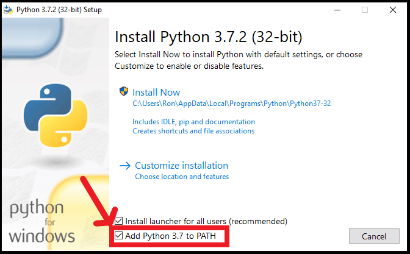
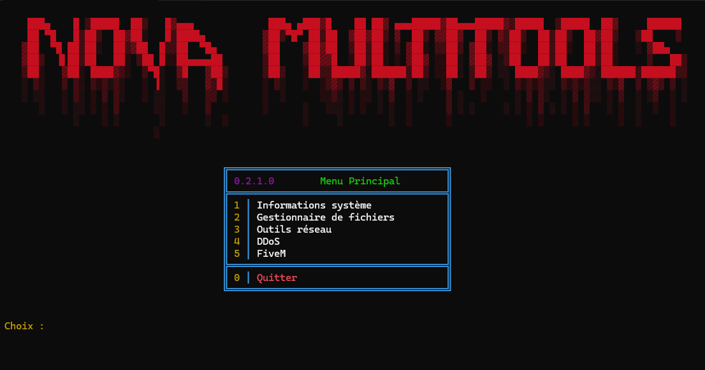
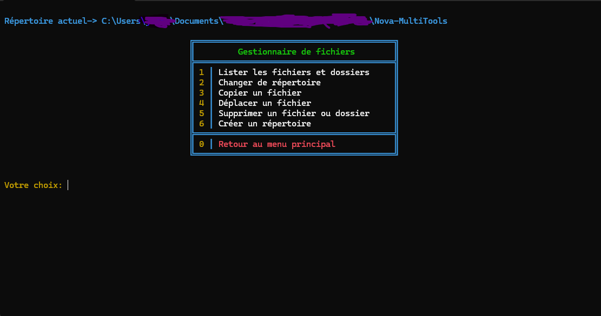
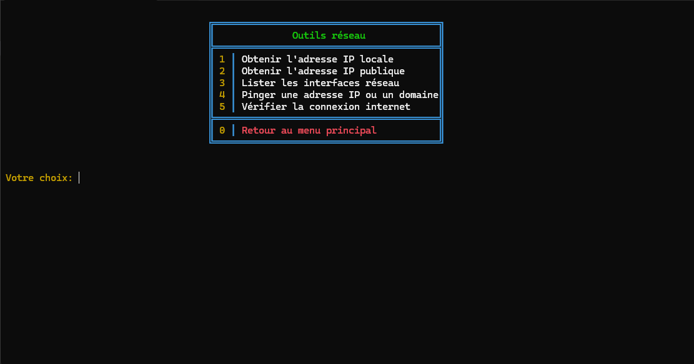
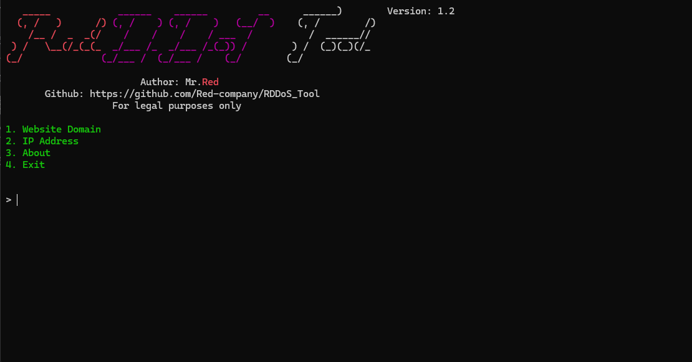
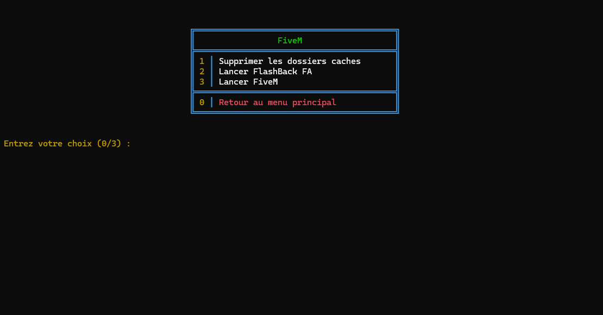

 

<p align="center">
  
  
</p>

<h3 align="center">⭐ Si vous aimez le projet, n'hésiter pas a mettre une étoile. ⭐</h3>

<h1>🧰・Nécessaire :</h1>
<h3>Windows :</h3>
<p>
- Installer <a href="https://git-scm.com/download/win">Git</a>.<br>
- Installer <a href="https://www.python.org/downloads/">Python</a> avec le "PATH options".<br>
- Windows 10 & 11 ou +.<br>
   
</p>

<h3>Linux :</h3>
<p>
- Installer <a href="https://git-scm.com/download/linux">Git</a>.<br>
- Avoir la dernière version de <a href="https://www.python.org/downloads/">Python</a>.<br>
- Avoir une version recente de Linux (dernière version -> + de chance de fonctionner).
</p>

<h1>📦・Installation :</h1>
<h3>Fichiers :</h3>
<p>
  
```
1 - Télécharger le projet en .zip (https://github.com/KaysiRB/Nova-MultiTools -> Code -> Download ZIP)
2 - Extraire le dossier 'Nova-MultiTools'
3 - Executer le fichier 'setup.py'
```
</p>

<h3>Commandes :</h3>
<p>
  
```
1 - Ouvrir un terminal.
2 - Ecrire "git clone https://github.com/KaysiRB/Nova-MultiTools.git"
3 - Ecrire "cd Nova-MultiTools"
4 - Ecrire "git pull"
5 - Ecrire "python setup.py"
```

<h1>📚・Utilisation :</h1>
<p>
  
```
- Executer le fichier 'multitool.py'
```
</p>

<h1>⚙️・Fonctionnalités :</h1>
<p align="center">
   
   
   
  
  
</p>

<h1>🔧・Outils :</h1>
<p>

```
📊 - Informations système
  ↳ OS Info
  ↳ CPU Info
  ↳ Memory Info (mémoire)
  ↳ Disk Info (Stockage)

🗃️ - Gestionnaire de fichiers
  ↳ List Files (lister fichiers du répertoire)
  ↳ Change Directory (changer de répertoire)
  ↳ Copy File (copier fichier/dossier)
  ↳ Move File (déplacer fichier/dossier)
  ↳ Delete File (supprimer fichier/dossier)
  ↳ Create Directory (creer fichier/dossier)

🌐 - Outils réseau
  ↳ Local IP
  ↳ Public IP
  ↳ List Network Interfaces 
  ↳ Ping Host (vérifier ping[ms])
  ↳ Check Internet Connection (vérifier connection)
  ↳ Scan Ports (scanner les ports)

💥 - DDoS
  ↳ Website Domain
  ↳ IP Adress

🎮 - FiveM
  ↳ Supprimer les dosiers caches
  ↳ Lancer un serveur en particulier
  ↳ Lancer FiveM
```
</p>

<h1>⚖️・Conditions d'Utilisations :</h1>
<p>
  "Nova MultiTools" a été développé uniquement à des fins éducatives. Ce projet a été créé avec de bonnes intentions et est destiné à un usage personnel uniquement. En choisissant d'utiliser "Nova MultiTools", vous reconnaissez et acceptez l'entière responsabilité de toutes les conséquences pouvant résulter de vos actions.
</p>

<h2>🔗・Crédits :</h2>

<p>
  - <a href="https://discord.gg/b2myvX5hMy">Discord</a><br>
  - <a href="https://github.com/Red-company/RDDoS_Tool">DDoS(Red company)</a><br> 
  - Createur: NovaOT (aka. KaysiRB)<br>
  - Version: 0.2.0.0
</p>
